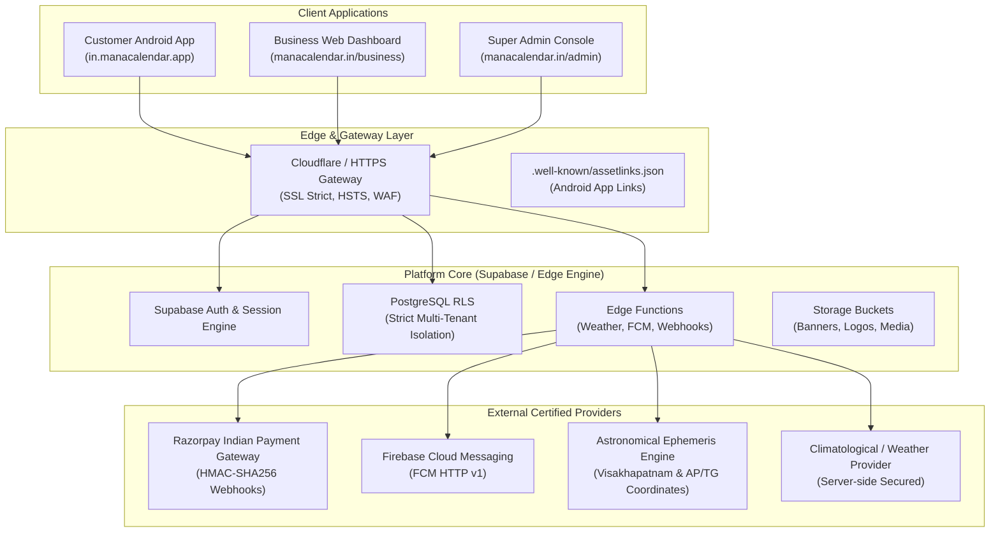

# Mana Calendar 2027 — System Architecture & Database Specification

**Document Version:** 1.0.0 (Production Release)  
**System Name:** Mana Calendar 2027 (మన క్యాలెండర్ 2027)  
**Target Region:** Andhra Pradesh & Telangana, India  
**Production Domain:** `https://manacalendar.in`  
**Android Application ID:** `in.manacalendar.app`  

---

## 1. System Topology & Architecture

Mana Calendar 2027 is a commercial, multi-tenant Telugu + English calendar ecosystem.

### Core Architecture Rules:
1. **Single Shared Android App:** There is strictly ONE Play Store application (`in.manacalendar.app`). Businesses are tenants inside the shared ecosystem; they do not have separate Play Store listings.
2. **Strict Multi-Tenant Isolation:** All business-specific records are partitioned by immutable `business_id` (e.g. `SLJ001`, `RF002`). Supabase Row Level Security (RLS) guarantees that Business A cannot read or write Business B's data under any circumstance.
3. **Customer View-Only Separation:** Customers are view-only consumers of calendar information and non-intrusive promotional partner banners. Customers have no business selection or tenant switching UI.

---

## 2. Production Database Schema (31 Core Tables)

The production PostgreSQL database comprises 31 audited tables:

| # | Table Name | Purpose | Primary Access & RLS Rule |
|---|---|---|---|
| 1 | `businesses` | Tenant master record (ID, name, slug, status, plan_id) | Public read active; Business view self; Admin full |
| 2 | `business_users` | Tenant staff accounts mapped to `auth.users` | Business user view own tenant; Admin full |
| 3 | `business_profiles` | Commercial profile (logo, cover, category, phone, WhatsApp) | Public read active; Business update self; Admin full |
| 4 | `customers` | Anonymous or registered mobile app customer identities | Customer view/update self; Admin full |
| 5 | `customer_businesses` | Business following relationship for customer updates | Customer manage own follows; Business view counts |
| 6 | `plans` | Commercial subscription plans (Business ₹1,999, Premium ₹3,999) | Public read active; Admin manage |
| 7 | `subscriptions` | Active tenant subscriptions and renewal dates | Business view own; Admin manage extensions |
| 8 | `payments` | Gateway-verified transaction ledger | Business view own; Admin manage; Edge write |
| 9 | `payment_webhooks` | Idempotent webhook logs with signature verification | Edge Function / Admin only |
| 10 | `banners` | 16:7 promotional banner creatives | Public read active; Business manage self |
| 11 | `campaigns` | Scheduled promotional offers (10 included/yr, ₹299 booster) | Public read active; Business manage self |
| 12 | `campaign_usage` | Audited campaign quota ledger per tenant per year | Business view self; Admin manage |
| 13 | `banner_events` | Impression and click telemetry | Public insert valid; Business view self agg |
| 14 | `media` | Stored images and creatives | Business manage own; Public read verified |
| 15 | `calendar_dates` | 2027 calendar dates with Telugu/English metadata | Public read; Admin manage |
| 16 | `festivals` | Verified AP & Telangana festival dates and descriptions | Public read; Admin manage |
| 17 | `panchangam` | Daily astronomical 5 Angas & Muhurthams | Public read; Admin manage |
| 18 | `weather_cache` | 3-hour cached regional weather forecasts | Public read; Edge update |
| 19 | `user_events` | Private user reminders (birthdays, anniversaries) | Customer manage own only |
| 20 | `reminders` | Scheduled local alarm and notification queue | Customer manage own only |
| 21 | `notification_devices` | Registered FCM device tokens | Customer manage own; Admin dispatch |
| 22 | `notification_preferences` | User toggle preferences for alerts | Customer manage own |
| 23 | `notifications` | In-app notification inbox records | Customer manage own; Admin view |
| 24 | `notification_deliveries` | FCM dispatch telemetry and delivery logs | System / Admin view |
| 25 | `notification_campaigns` | Premium-tier business push broadcasts | Premium business manage; Admin moderate |
| 26 | `support_tickets` | Customer and merchant support tickets | Creator view own; Support admin manage |
| 27 | `admin_users` | Internal platform governance operators | Super Admin manage |
| 28 | `admin_roles` | Granular roles (Owner, Admin, Content Admin, Support) | Super Admin manage |
| 29 | `admin_permissions` | Server-side role permission matrix | Super Admin manage |
| 30 | `platform_settings` | Global configuration and provider switches | Super Admin manage |
| 31 | `audit_logs` | Immutable audit trail with state diffs (`before`/`after`) | Append-only; Super Admin view |

---

## 3. Production Indexing Matrix

To guarantee sub-50ms query response times under high concurrency (1,000+ businesses and 100,000+ customer sessions):

* **Tenant Lookups:** `CREATE INDEX idx_perf_businesses_status ON public.businesses(status);`
* **Campaign Scheduling:** `CREATE INDEX idx_perf_campaigns_lookup ON public.campaigns(business_id, status, start_date, end_date);`
* **Banner Delivery:** `CREATE INDEX idx_perf_banners_lookup ON public.banners(business_id, status, slot_position);`
* **Calendar & Date Details:** `CREATE INDEX idx_prod_cal_dates_lookup ON public.calendar_dates(year, month, day);`
* **Panchangam Lookups:** `CREATE INDEX idx_perf_panchangam_date ON public.panchangam(calendar_date);`
* **Weather Cache:** `CREATE INDEX idx_perf_weather_coords_cached ON public.weather_cache(latitude, longitude, cached_at DESC);`
* **User Events:** `CREATE INDEX idx_prod_user_events_customer ON public.user_events(customer_id, event_date);`
* **Deferred Deep Links:** `CREATE INDEX idx_deferred_token ON public.deferred_deeplinks(token);`
