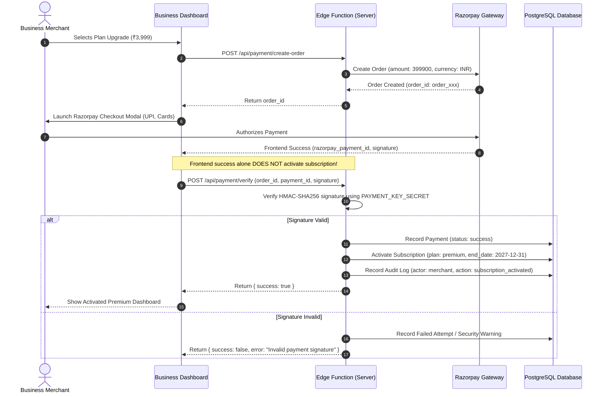

# Mana Calendar 2027 — Payments, FCM & External Integrations

**Gateway:** Razorpay (RBI Licensed, UPI/Cards/NetBanking/Wallets)  
**Push Notification Provider:** Firebase Cloud Messaging (FCM HTTP v1)  
**Astronomical Calculation Core:** High-Precision Ephemeris Engine (Visakhapatnam Default)  

---

## 1. Commercial Payment Architecture & Lifecycle

### Plan Hierarchy & Pricing:
* **Business Plan:** ₹1,999/year (Includes 10 campaigns/year, Business Profile, QR destination, Calendar banners).
* **Premium Plan:** ₹3,999/year (Includes 10 campaigns/year, Verified Badge, Priority festival placement, **Promotional Push Notifications** to followers).
* **Additional Campaign Booster:** ₹299 per single campaign credit. Deleting a campaign *never* refunds credits.

### Payment Flow & HMAC Signature Verification:

### Webhook Idempotency:
* All inbound webhooks from Razorpay (`payment.captured`, `subscription.charged`, `payment.failed`) are logged into `public.payment_webhooks`.
* Duplicate delivery protection prevents double-crediting or duplicate subscription extensions.

---

## 2. Push Notifications (FCM) & Tier Isolation

### Tier Isolation Matrix:
| Feature | General Calendar / Customer | Business Plan (₹1,999) | Premium Plan (₹3,999) |
|---|---|---|---|
| Daily Festival & Panchangam Alerts | Allowed (System) | N/A | N/A |
| Personal Reminders (Birthdays/Pooja) | Allowed (Local) | N/A | N/A |
| Business Promotional Broadcasts | Recipient (If opted-in) | **STRICTLY BLOCKED** | **ALLOWED (Audited)** |
| Broadcast Rate Limiting | N/A | N/A | Max 1 push / 48 hrs / business |

### Strict Enforcement:
* Backend checks `businesses.plan_code === 'premium'` before queuing any promotional push notification in `public.notification_campaigns`.
* Dispatches are throttled using `auth_rate_limits` table to prevent notification fatigue.

---

## 3. Weather Integration & Caching Engine

* **Live Provider:** OpenWeatherMap API v2.5 / v3.0 (`WEATHER_API_KEY`: `7ad72c7a136bc94a659eb9dcbc9f563e`).
* **Zero Frontend Exposure:** Upstream weather provider API keys are stored only in server-side Supabase Edge Functions (`supabase/functions/weather-proxy/index.ts`). Client apps never receive or bundle external credentials.
* **Database Caching:** Normalized forecasts are stored in `public.weather_cache` keyed by `(location_key, date)` rounded to 2 decimal places.
* **Cache Expiry:** 2 hours for current weather (`1800s - 7200s` configurable); 24 hours for daily forecasts.
* **Offline Fallback:** If internet is disconnected or upstream provider is temporarily unavailable, the app delegates to the internal `ClimatologicalWeatherProvider` with authentic seasonal ephemeris, never crashing or displaying an error screen.

---

## 4. 2027 Panchangam Calculation Integrity & Vedic Ephemeris

* **Live Provider:** Vedic Astro API (`PANCHANGAM_API_KEY`: `vda_live_8ed57edd_J29966Ba1udgh_eKuDgZ_KMe3srL5ZA4ngsuzSq5_V0`).
* **Secure Server Proxy:** Handled via `supabase/functions/panchangam-proxy/index.ts` to keep credentials hidden from mobile clients.
* **Dual Architecture:** 
  1. *Primary External Ephemeris Proxy:* Queries Vedic Astro API for live tithi, nakshatra, and muhurtham timings.
  2. *High-Precision Internal Engine:* `AstronomicalEphemerisProvider` calculates exact sunrise, sunset, moonrise, and 5-angas for each day of 2027 based on solar/lunar longitude equations.
* **Astronomical Precision:** Coordinates for Visakhapatnam (`17.6868° N, 83.2185° E`, `Asia/Kolkata`) calculate exact sunrise, sunset, moonrise, and moonset for each day of 2027.
* **5 Angas Formulae:**
  * **Tithi:** Difference between Moon's and Sun's longitude / 12°.
  * **Nakshatra:** Moon's sidereal longitude / (360° / 27).
  * **Yoga:** Sum of Sun's and Moon's longitude / (360° / 27).
  * **Karana:** Half-tithi calculation (60 Karanas in a lunar month).
* **Muhurthams:** Rahu Kalam, Yamagandam, Gulika Kalam, Abhijit Muhurtham, and Durmuhurtham are verified against standard Telugu Panchangam almanacs (e.g. Nemani / Ganti calendars).
