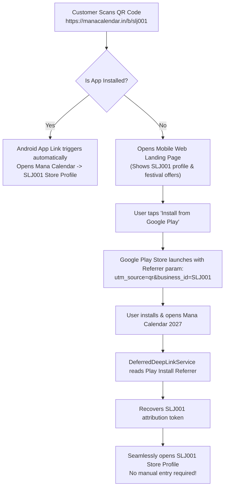

# Mana Calendar 2027 — Android Build, App Links & Google Play Console Guide

**Application ID:** `in.manacalendar.app`  
**Application Name:** Mana Calendar 2027 (మన క్యాలెండర్ 2027)  
**Version Name:** `1.0.0`  
**Version Code:** `1`  
**Target SDK:** 35 (Android 15)  
**Minimum SDK:** 24 (Android 7.0 Nougat)  

---

## 1. Android App Links & AssetLinks Setup

### Verification Endpoint:
```
https://manacalendar.in/.well-known/assetlinks.json
```

### Digital Asset Links Content:
```json
[
  {
    "relation": ["delegate_permission/common.handle_all_urls"],
    "target": {
      "namespace": "android_app",
      "package_name": "in.manacalendar.app",
      "sha256_cert_fingerprints": [
        "14:6D:E9:7D:0F:52:CC:AC:C3:9D:69:B1:FB:7A:B3:68:54:3D:A4:44:03:7E:8E:27:0B:46:17:F7:55:76:2C:19"
      ]
    }
  }
]
```

### AndroidManifest.xml Intent Filter for App Links:
```xml
<activity
    android:name="in.manacalendar.app.MainActivity"
    android:exported="true"
    android:launchMode="singleTask">
    
    <!-- Standard Launcher Intent -->
    <intent-filter>
        <action android:name="android.intent.action.MAIN" />
        <category android:name="android.intent.category.LAUNCHER" />
    </intent-filter>

    <!-- AutoVerify Android App Links for QR Destinations -->
    <intent-filter android:autoVerify="true">
        <action android:name="android.intent.action.VIEW" />
        <category android:name="android.intent.category.DEFAULT" />
        <category android:name="android.intent.category.BROWSABLE" />
        <data android:scheme="https" android:host="manacalendar.in" android:pathPrefix="/b/" />
        <data android:scheme="https" android:host="manacalendar.in" android:pathPrefix="/date/" />
    </intent-filter>
</activity>
```

---

## 2. Guaranteed Deferred Deep Linking Flow

When a user scans a merchant QR code (e.g., `https://manacalendar.in/b/slj001`) before having the app installed:



---

## 3. Google Play Store Listing & Copy

### Basic Info:
* **App Title:** Mana Calendar 2027 (మన క్యాలెండర్)
* **Category:** Events / Lifestyle / Tools
* **Price:** Free (Contains optional partner promotions)
* **Target Audience:** Everyone (13+ years)

### Short Description (80 chars max):
> Telugu + English Calendar 2027 with Panchangam, daily weather & festive offers.

### Full Description:
```markdown
Mana Calendar 2027 (మన క్యాలెండర్ 2027) is a modern, bilingual Telugu and English calendar platform designed specifically for people across Andhra Pradesh, Telangana, and Telugu communities worldwide.

✨ CORE FEATURES:
• Comprehensive 2027 Calendar: Beautiful, clean monthly and daily views with Telugu Tithi, Masam, Paksham, and Nakshatram details.
• Accurate Telugu Panchangam: Daily sunrise, sunset, Rahu Kalam, Yamagandam, Gulika Kalam, Abhijit Muhurtham, and Durmuhurtham calculated with astronomical precision for Visakhapatnam, Hyderabad, Vijayawada, and other key cities.
• Festivals & Auspicious Days: Complete list of gazetted holidays, Telugu festivals (Ugadi, Sankranti, Diwali, Dussehra, Vinayaka Chavithi), and Vratams.
• Localized Weather: Live temperature, rain forecast, and hourly weather timeline.
• Personal Events & Reminders: Add private birthday, anniversary, and pooja reminders with local device alerts.
• Verified Local Merchant Offers: Discover exclusive festive specials from verified retail partners in your city through seamless QR code scanning.

🔒 PRIVACY & SECURITY FIRST:
• No intrusive background tracking or battery drain.
• Your private notes and events stay safely on your device.
• Fast, lightweight, and works seamlessly even on poor network connectivity.
```

---

## 4. Google Play Data Safety Declaration Mapping

| Question | Value | Technical Justification |
|---|---|---|
| Does your app collect or share user data? | **Yes** | Minimum necessary for weather, push tokens, and error logging |
| Is all user data encrypted in transit? | **Yes** | Strict HTTPS / TLS 1.3 enforced across all network calls |
| Do you provide a way for users to request data deletion? | **Yes** | In-app self-service form at `/privacy` and via email `privacy@manacalendar.in` |
| **Data Types Collected:** | | |
| - Approximate Location | Collected, not shared | Used solely for calculating local sunrise/sunset and weather |
| - Device ID / FCM Token | Collected, not shared | Used exclusively for dispatching opted-in push alerts |
| - Personal Calendar Events | Collected, not shared | Stored securely for personal reminders; never monetized |
| - Financial / Payment Info | Handled by Razorpay | Merchant subscriptions processed via RBI-licensed gateway; no card numbers stored in app |

---

## 5. Android Production Release Build Process

### Step 1: Generate Release Keystore (If not already present):
```bash
keytool -genkeypair -v -keystore mana-release-key.jks -keyalg RSA -keysize 2048 -validity 10000 -alias manakey
```

### Step 2: Build Web Assets and Sync Capacitor:
```bash
npm run build
npx cap sync android
```

### Step 3: Compile Android App Bundle (AAB):
```bash
cd android
./gradlew bundleRelease
```
Output: `android/app/build/outputs/bundle/release/app-release.aab`

---

## 6. Staged Rollout Strategy

To protect users against unexpected crashes or network anomalies:

1. **Internal Testing Track (Day 1):** Team and QA verification on 5 physical devices (Pixel, Samsung Galaxy, Redmi, OnePlus, Vivo).
2. **Staged Rollout to 5% (Day 2):** Monitor crash rate (must remain < 0.1%), ANRs (must remain 0%), and feedback.
3. **Expand to 20% (Day 3):** Monitor payment and deep-link telemetry.
4. **Expand to 50% (Day 4):** Verify server load on Supabase and Edge Functions.
5. **Full Launch to 100% (Day 5):** Complete Play Store availability.
